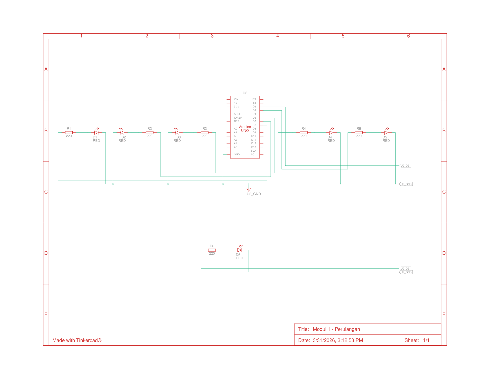

## Pertanyaan Praktikum Perulangan 1.6.4

1. Gambarkan rangkaian schematic 5 LED running yang digunakan pada percobaan!  
2. Jelaskan bagaimana program membuat efek LED berjalan dari kiri ke kanan! 
3. Jelaskan bagaimana program membuat LED kembali dari kanan ke kiri! 
4. Buatkan program agar LED menyala tiga LED kanan dan tiga LED kiri secara bergantian
dan berikan penjelasan disetiap baris kode nya dalam bentuk README.md!

---

## Jawaban

### 1. Rangkaian Schematic 5 LED Running

Berikut adalah gambar rangkaian schematic yang digunakan pada percobaan:



---

### 2. Penjelasan Program LED Berjalan dari Kiri ke Kanan

Berikut adalah bagian kode yang membuat efek LED berjalan **dari kiri ke kanan**:

```cpp
int timer = 100;           
// delay timer

void setup() { 
  // Perulangan for untuk menginisialisasi output:
  for (int ledPin = 2; ledPin < 8; ledPin++) { 
    pinMode(ledPin, OUTPUT); 
  } 
} 

void loop() { 
    // looping dari pin rendah ke tinggi 
    for (int ledPin = 2; ledPin < 8; ledPin++) { 
      digitalWrite(ledPin, HIGH); //hidup
      delay(timer); 
      digitalWrite(ledPin, LOW); //mati
```

#### Penjelasan Detail:

1. **`int timer = 100;`**  
   Variabel `timer` menyimpan nilai **100 milidetik** yang digunakan sebagai durasi delay.

2. **Fungsi `setup()`**:  
   ```cpp
   for (int ledPin = 2; ledPin < 8; ledPin++) { 
     pinMode(ledPin, OUTPUT); 
   }
   ```
   - Menggunakan **loop `for`** yang dimulai dari `ledPin = 2` hingga `ledPin = 7` .
   - Setiap iterasi, fungsi `pinMode(ledPin, OUTPUT)` dipanggil untuk mengatur pin digital 2, 3, 4, 5, 6, dan 7 sebagai **OUTPUT**.
   - Fungsi `setup()` hanya dieksekusi **satu kali** saat Arduino pertama kali dinyalakan atau di-reset.

3. **Efek LED Berjalan Kiri ke Kanan** (dalam `loop()`):  
   ```cpp
   for (int ledPin = 2; ledPin < 8; ledPin++) { 
     digitalWrite(ledPin, HIGH);  // Nyalakan LED
     delay(timer);                // Tunggu 100ms
     digitalWrite(ledPin, LOW);   // Matikan LED
   }
   ```
   - Loop `for` berjalan dari **pin 2 (paling kiri) ke pin 7 (paling kanan)**.
   - Pada setiap iterasi:
     - **`digitalWrite(ledPin, HIGH)`** → Menyalakan LED pada pin yang sedang aktif.
     - **`delay(timer)`** → Menahan LED tetap menyala selama **100 milidetik**.
     - **`digitalWrite(ledPin, LOW)`** → Mematikan LED tersebut sebelum berpindah ke LED berikutnya.
---

### 3. Penjelasan Program LED Kembali dari Kanan ke Kiri

Berikut adalah bagian kode yang membuat efek LED berjalan **dari kanan ke kiri**:

```cpp
    // looping dari pin yang tinggi ke yang rendah 
    for (int ledPin = 7; ledPin >= 2; ledPin--) {  
      digitalWrite(ledPin, HIGH); //hidup
      delay(timer); 
      digitalWrite(ledPin, LOW); //mati
    }
```

#### Penjelasan Detail:

1. **Loop `for` dengan arah terbalik**:
   ```cpp
   for (int ledPin = 7; ledPin >= 2; ledPin--)
   ```
   - Loop dimulai dari **`ledPin = 7`** (pin paling kanan/tertinggi).
   - Kondisi loop adalah **`ledPin >= 2`**, artinya loop terus berjalan selama nilai `ledPin` lebih besar atau sama dengan 2.
   - **`ledPin--`** berarti setiap iterasi, nilai `ledPin` **berkurang 1** (decremented). Jadi urutannya: 7 → 6 → 5 → 4 → 3 → 2.

2. **Proses menyalakan dan mematikan LED**:
   ```cpp
   digitalWrite(ledPin, HIGH);  // Nyalakan LED pada pin saat ini
   delay(timer);                // Tunggu 100ms
   digitalWrite(ledPin, LOW);   // Matikan LED
   ```
   - Mekanismenya **sama persis** dengan loop kiri-ke-kanan, namun **arah pergerakannya terbalik**.
   - Pada setiap iterasi:
     - LED pada pin yang sedang aktif **dinyalakan** (`HIGH`).
     - Program menunggu selama **100 milidetik** (`delay(timer)`).
     - LED tersebut **dimatikan** (`LOW`) sebelum pindah ke pin berikutnya yang lebih rendah.

3. **Urutan eksekusi**: LED di pin 7 menyala → mati → pin 6 menyala → mati → pin 5 menyala → mati → ... → pin 2 menyala → mati.

4. **Gabungan kedua loop** menciptakan efek **bolak-balik (ping-pong)**:
   - **Loop pertama** (kiri ke kanan): pin 2 → 3 → 4 → 5 → 6 → 7
   - **Loop kedua** (kanan ke kiri): pin 7 → 6 → 5 → 4 → 3 → 2
   - Setelah loop kedua selesai, fungsi `loop()` akan **mengulangi dari awal** secara terus-menerus, sehingga LED terlihat berjalan bolak-balik tanpa henti.

---

### 4. Program LED 3 Kanan dan 3 Kiri Bergantian

#### Kode Program Modifikasi:

```cpp
// Program LED menyala 3 kanan dan 3 kiri secara bergantian

int timer = 500; // Variabel waktu delay 500 milidetik

void setup() {
  // Inisialisasi pin 2 hingga 7 sebagai OUTPUT
  for (int ledPin = 2; ledPin < 8; ledPin++) {  // Loop dari pin 2-7
    pinMode(ledPin, OUTPUT);                    // Set OUTPUT
  }
}

void loop() {
  // === FASE 1: Menyalakan 3 LED KIRI (pin 2, 3, 4) ===
  for (int ledPin = 2; ledPin < 5; ledPin++) {  // Loop 2-4
    digitalWrite(ledPin, HIGH);                 // Nyalakan LED 2-4
  }
  for (int ledPin = 5; ledPin < 8; ledPin++) {  // Loop 5-7
    digitalWrite(ledPin, LOW);                  // Matikan LED 5-7
  }
  delay(timer);                                 // Tahan 500 ms

  // === FASE 2: Menyalakan 3 LED KANAN (pin 5, 6, 7) ===
  for (int ledPin = 2; ledPin < 5; ledPin++) {  // Loop 2-4
    digitalWrite(ledPin, LOW);                    // Matikan LED 2-4
  }
  for (int ledPin = 5; ledPin < 8; ledPin++) {  // Loop 5-7
    digitalWrite(ledPin, HIGH);                   // Nyalakan LED 5-7
  }
  delay(timer);                                   // Tahan 500 ms
}
```

#### Penjelasan Baris per Baris:

##### Bagian Deklarasi Variabel:
```cpp
int timer = 500;
```
- Mendeklarasikan variabel **`timer`** bertipe integer dengan nilai **500**.

##### Fungsi `setup()`:
```cpp
void setup() {
  for (int ledPin = 2; ledPin < 8; ledPin++) {
    pinMode(ledPin, OUTPUT);
  }
}
```
- **`void setup()`**  Fungsi yang dijalankan **satu kali** saat Arduino dinyalakan.
- **`for (int ledPin = 2; ledPin < 8; ledPin++)`**  Loop yang berjalan dari pin 2 hingga pin 7.
- **`pinMode(ledPin, OUTPUT)`**  Mengatur setiap pin (2, 3, 4, 5, 6, 7) sebagai **output**, sehingga bisa mengirimkan sinyal HIGH/LOW ke LED.

##### Fungsi `loop()`  FASE 1 (3 LED Kiri Menyala):
```cpp
for (int ledPin = 2; ledPin < 5; ledPin++) {
  digitalWrite(ledPin, HIGH);
}
```
- Loop dari pin **2 sampai 4** (3 LED paling kiri).
- **`digitalWrite(ledPin, HIGH)`** menyalakan ketiga LED tersebut secara berurutan.

```cpp
for (int ledPin = 5; ledPin < 8; ledPin++) {
  digitalWrite(ledPin, LOW);
}
```
- Loop dari pin **5 sampai 7** (3 LED paling kanan).
- **`digitalWrite(ledPin, LOW)`** memastikan ketiga LED kanan dalam keadaan **mati**.

```cpp
delay(timer);
```
- Menunggu selama **500 milidetik** agar kondisi 3 LED kiri menyala dapat terlihat.

##### Fungsi `loop()`  FASE 2 (3 LED Kanan Menyala):
```cpp
for (int ledPin = 2; ledPin < 5; ledPin++) {
  digitalWrite(ledPin, LOW);
}
```
- Mematikan 3 LED kiri (pin 2, 3, 4).

```cpp
for (int ledPin = 5; ledPin < 8; ledPin++) {
  digitalWrite(ledPin, HIGH);
}
```
- Menyalakan 3 LED kanan (pin 5, 6, 7).

```cpp
delay(timer);
```
- Menunggu selama **500 milidetik** agar kondisi 3 LED kanan menyala dapat terlihat.


Program akan terus **berulang tanpa henti** (karena berada di dalam fungsi `loop()`), sehingga menghasilkan efek **3 LED kiri dan 3 LED kanan menyala bergantian** secara terus menerus.
