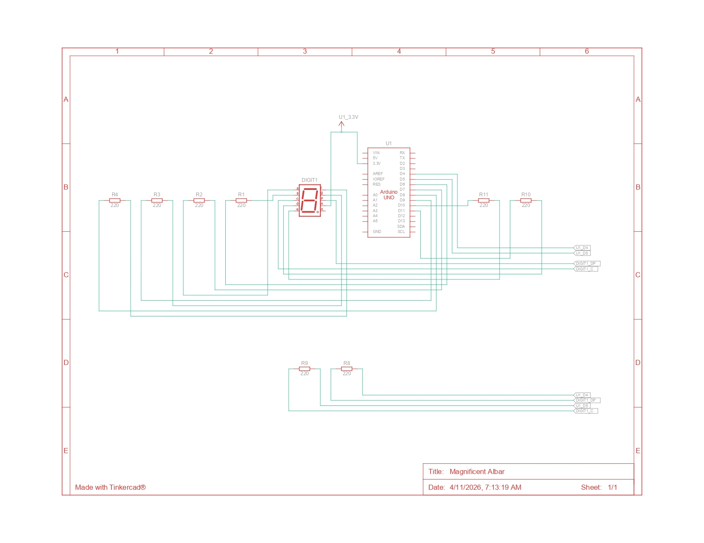

## Pertanyaan Praktikum Seven Segment 2.5.4

1. Gambarkan rangkaian schematic yang digunakan pada percobaan! 
2. Apa yang terjadi jika nilai num lebih dari 15? 
3. Apakah program ini menggunakan common cathode atau common anode? Jelaskan 
alasanya! 
4. Modifikasi program agar tampilan berjalan dari F ke 0 dan berikan penjelasan disetiap 
baris kode nya dalam bentuk README.md! 
---

## Jawaban

### 1. Skematik Rangkaian


Berikut adalah gambar rangkaian schematic yang digunakan pada percobaan:




---

### 2. Jika Nilai `num` Lebih dari 15

Akan terjadi **error array out-of-bounds**, sehingga seven segment menampilkan pola acak karena program mengakses memori di luar batas array `digitPattern`.

---

### 3. Common Cathode atau Common Anode?

Program ini menggunakan **Common Anode**. 
**Alasannya:** Pada kode `!digitPattern[num][i]`, nilai `1` (ON) di-*invert* menjadi `0` (LOW). Ini membuktikan segmen menyala saat diberi logika LOW, yang merupakan karakteristik dari Common Anode.

---

### 4. Modifikasi: Tampilan F ke 0


```cpp
#include <Arduino.h>

const int segmentPins[8] = {7, 6, 5, 11, 10, 8, 9, 4};

byte digitPattern[16][8] = {
  {1,1,1,1,1,1,0,0}, //0
  {0,1,1,0,0,0,0,0}, //1
  {1,1,0,1,1,0,1,0}, //2
  {1,1,1,1,0,0,1,0}, //3
  {0,1,1,0,0,1,1,0}, //4
  {1,0,1,1,0,1,1,0}, //5
  {1,0,1,1,1,1,1,0}, //6
  {1,1,1,0,0,0,0,0}, //7
  {1,1,1,1,1,1,1,0}, //8
  {1,1,1,1,0,1,1,0}, //9
  {1,1,1,0,1,1,1,0}, //A
  {0,0,1,1,1,1,1,0}, //b
  {1,0,0,1,1,1,0,0}, //C
  {0,1,1,1,1,0,1,0}, //d
  {1,0,0,1,1,1,1,0}, //E
  {1,0,0,0,1,1,1,0}  //F
};

void displayDigit(int num) {
  for(int i = 0; i < 8; i++) {
    digitalWrite(segmentPins[i], !digitPattern[num][i]);
  }
}

void setup() {
  for(int i = 0; i < 8; i++) {
    pinMode(segmentPins[i], OUTPUT);
  }
}

void loop() {
  for(int i = 15; i >= 0; i--) {  // Loop dari 15 (F) turun ke 0
    displayDigit(i);
    delay(1000);
  }
}
```

**Perubahan utama:** Loop diubah dari `i=0; i<16; i++` menjadi `i=15; i>=0; i--` agar urutan tampilan dimulai dari **F (indeks 15)** turun ke **0 (indeks 0)**.